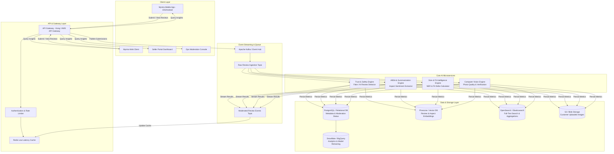
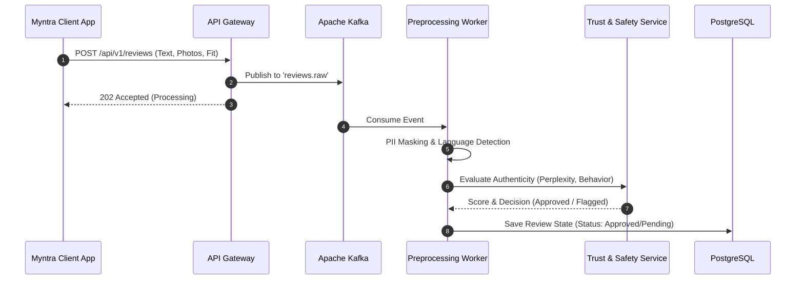
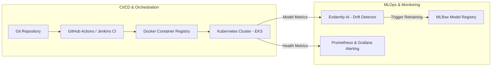

# System Architecture: Myntra AI Review Intelligence & Governance Engine

> **Document Version:** 1.0.0  
> **Target Audience:** System Architects, AI/ML Engineers, Backend Engineers, Product Managers  
> **Source Context:** Based on [docs/problemstatement.md](file:///c:/Users/DELL/OneDrive/Desktop/kartikey/myntra%20rev%20eng/docs/problemstatement.md)

---

## 1. High-Level Architecture Overview

The **Myntra AI Review Intelligence Engine** is a high-throughput, low-latency distributed system designed to process user-generated reviews (text, images, ratings, and fit feedback) in real time. It enforces review authenticity, distills aspect-based customer sentiment, extracts body-metric intelligence, and powers real-time UI components across Myntra's mobile and web platforms.



---

## 2. Ingestion & Preprocessing Pipeline

### 2.1 Event-Driven Processing Workflow
1. **User Action:** A customer submits a product review (Star Rating, Review Text, Size Worn, Height/Weight metrics, Garment Photos).
2. **Gateway Validation:** The API Gateway validates JWT tokens, rate limits submissions, and sanitizes input text against cross-site scripting (XSS).
3. **Kafka Ingestion:** The submission event is pushed to `kafka.reviews.raw` with partition key `sku_id` to guarantee ordering per product.
4. **Preprocessing Worker:**
   - **PII Scrubbing:** Redacts phone numbers, emails, or personal handles using Regex and SpaCy entity masking.
   - **Language Identification:** Detects language (English, Hindi, Hinglish) and routes to appropriate NLP translation/tokenization pipelines.



---

## 3. Core AI Microservices Deep-Dive

### 3.1 Trust & Safety Engine (Fake / Synthetic Review Detector)
Designed to protect platform integrity by detecting machine-generated (LLM) text, bot spam, and incentivized fake reviews.

* **Text Feature Extractor:**
  - **Perplexity & Burstiness Analysis:** Evaluates token distribution entropy. LLM-generated text exhibits lower burstiness and unnatural uniform entropy compared to human writing.
  - **Stylometric Profiling:** Tracks vocabulary richness, punctuation patterns, and repetitive phrase n-grams.
* **Behavioral & Graph Features:**
  - Reviewer account age, historical purchase verification (`Verified Purchaser` tag).
  - Velocity checks (number of reviews posted per IP/Device fingerprint per hour).
* **Rating-Text Sentiment Variance:** Flags reviews where numerical rating (e.g., `5 Stars`) strongly diverges from text sentiment (e.g., `"Item tore after one wash, terrible quality"`).

```
[Raw Review] ──► [Perplexity Evaluator] ──┐
             ──► [Behavioral Profiler]   ──┼──► [Gradient Boosted Ensemble] ──► Classification
             ──► [Sentiment Discrepancy] ──┘   (Rule: Score > 0.85 -> Approve, < 0.40 -> Reject)
```

### 3.2 Aspect-Based Sentiment Analysis (ABSA) & Summarization
Extracts fashion-specific attributes to generate structured pros, cons, and aspect scores for every SKU.

* **Aspect Extractor (Fine-Tuned RoBERTa/DeBERTa):**
  - Identifies domain categories: `Fabric Quality`, `Color Accuracy`, `Stitching/Durability`, `Transparency`, `Shrinkage`.
* **Polarity Classification:** Classifies sentiment per aspect into `Positive`, `Neutral`, or `Negative`.
* **LLM Cluster Summarizer:** Clusters aspect-level text snippets across thousands of reviews and generates concise 1-sentence summaries using quantized LLM inference (e.g., Llama-3-8B / Gemini Flash).
  - *Example Output:* `"88% of buyers praise the soft cotton feel, but 14% report minor fading after multiple washes."`

### 3.3 Size & Fit Intelligence Engine
Extracts user body metrics and garment fit behavior to power personalized sizing recommendations.

* **Body Metric NER (Named Entity Recognition):**
  - Recognizes expressions: `"I am 5'9 ft"`, `"Weight 70 kg"`, `"Normally wear Size L"`, `"Broad shoulders"`.
* **Fit Delta Classifier:**
  - Categorizes fit feedback into discrete buckets: `Runs Small (-1)`, `True to Size (0)`, `Runs Large (+1)`.
* **Dynamic Fit Curve Generation:** Computes normal distribution curves per SKU across height, body build, and size bought to display dynamic fit bars on product pages.

### 3.4 Computer Vision Image Analytics
Analyzes customer-uploaded photos to ensure visual review quality.

* **Quality Filter:** Detects blurriness, extreme low light, inappropriate content, or non-apparel images (e.g., shipping labels).
* **Color & Pattern Verification:** Compares uploaded photo color histograms against seller catalog reference images to flag misdelivered or wrong-color products.

---

## 4. Data Storage & Indexing Architecture

| Storage Layer | Engine | Data Model / Schema | Use Case |
| :--- | :--- | :--- | :--- |
| **Relational Store** | PostgreSQL (Amazon RDS) | Structured relational tables (`reviews`, `moderation_logs`, `users`, `skus`) | Source of truth for review status, user accounts, and moderation decisions |
| **Vector Database** | Pinecone / Qdrant | Dense vector embeddings (768-dim / 1536-dim) | Semantic review search, finding similar user body types, review deduplication |
| **Search Engine** | OpenSearch / Elasticsearch | Inverted index document store | Rapid text search, filtering reviews by height/weight, aspect facet counts |
| **Blob Storage** | AWS S3 / Cloudflare R2 | CDN-cached object store (`/raw_images/`, `/thumbnails/`) | Customer-uploaded photos and compressed video clips |
| **Analytics Warehouse** | Snowflake / BigQuery | Columnar star schema (`fact_review_events`, `dim_product_aspects`) | Long-term trend analysis, seller brand reports, ML retraining pipelines |

---

## 5. Caching & Query Serving Strategy

To achieve sub-50ms latency on Myntra product pages during high-concurrency peak traffic (e.g., Big Fashion Festival with 100k+ req/sec):

1. **Pre-Aggregated SKU Summary Cache (Redis Cluster):**
   - Key: `sku:insight_summary:{sku_id}`
   - Value: JSON object containing overall rating, aspect breakdown, size fit curve, and top AI summary bullets.
   - TTL: 1 hour (invalidated and re-computed when a new batch of 50+ reviews are approved).
2. **User Fit Preference Cache:**
   - Key: `user:fit_profile:{user_id}`
   - Value: Saved height, weight, preferred fit tightness. Automatically filters SKU reviews to match the user's specific body profile.

```json
{
  "sku_id": "MYN-TSHIRT-10928",
  "total_reviews": 4820,
  "overall_rating": 4.4,
  "fit_summary": {
    "runs_small_pct": 12,
    "true_to_size_pct": 78,
    "runs_large_pct": 10
  },
  "aspect_highlights": [
    { "aspect": "Fabric", "positive_pct": 91, "summary": "Super soft 100% combed cotton" },
    { "aspect": "Color", "positive_pct": 86, "summary": "Vibrant blue, identical to catalog photos" }
  ],
  "ai_summary": "Shoppers highlight the comfortable fabric and accurate fit. Recommended to buy your standard size."
}
```

---

## 6. Security, Governance & Compliance

* **Data Privacy (DPDP Act & GDPR):** All user body metrics (height, weight) collected during reviews are anonymized and decoupled from personally identifiable account info (Name, Mobile Number).
* **Content Moderation Safety Rules:** Automated blocking of profanity, hate speech, external URLs, and malicious links.
* **Role-Based Access Control (RBAC):** Moderation team members access data via role-restricted APIs (e.g., `Moderator`, `BrandManager`, `SystemAdmin`).

---

## 7. Deployment & MLOps Infrastructure



* **Microservices Containerization:** All NLP services packaged into Docker containers and orchestrated via Kubernetes (EKS).
* **Auto-Scaling:** HPA (Horizontal Pod Autoscaling) configured on CPU/GPU utilization and Kafka lag metrics.
* **Model Monitoring & Drift Detection:**
  - **Evidently AI:** Tracks input text distribution drift over time (e.g., emerging fashion slang, new brand terminology).
  - **Performance Tracking:** Continuous auditing of model false-positive rates via human-in-the-loop audit sampling (1% of auto-approved reviews).
