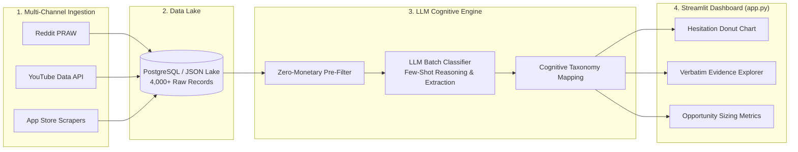
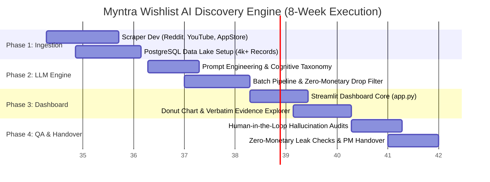

# Implementation Plan: Myntra Wishlist AI Discovery & Intelligence Engine

> **Project Name:** Myntra Wishlist Cognitive Intelligence & Friction Discovery Engine  
> **Project Type:** Internal Growth & Product Discovery Analytics Tool  
> **Owner:** Myntra Growth Product & AI Strategy Team  
> **Execution Roadmap:** 8-Week Phased Delivery Plan  
> **Document Version:** 2.0.0 (Internal Analytics Architecture)  

---

## 1. Executive Summary & Roadmap (8 Weeks)

The **Myntra Wishlist AI Discovery & Intelligence Engine** is an internal analytical engine designed to decode the psychological, UX, and non-monetary friction points preventing users from converting wishlist items into active purchases. While millions of high-intent shoppers save products to their wishlists, a large percentage of these items remain unpurchased due to decision paralysis, styling ambiguity, sizing hesitation, or catalog fatigue rather than product pricing.

This project delivers an automated, internal intelligence pipeline that scrapes authentic consumer discussions across public channels (Reddit, YouTube, App Store), processes unstructured feedback via LLM batch classification into a rigid cognitive taxonomy, and serves interactive insights to Product Managers through an executive Streamlit dashboard.



### Strict Governance: Zero-Monetary Incentives Rule
> [!IMPORTANT]
> **Core Constraint: Zero Monetary Incentives**  
> To isolate pure product experience, styling friction, and decision confidence, the engine strictly enforces a **Zero Monetary Incentives** rule. All feedback concerning prices, discounts, sales, coupons, cashback, or wallet promotions are categorized as `Monetary_Wait` and programmatically filtered out before opportunity sizing.



---

## 2. Detailed Phase Breakdowns

### Phase 1: Multi-Channel Data Ingestion (Weeks 1 – 2)
**Primary Objective:** Build reliable, modular Python scraping pipelines to ingest 4,000+ unstructured customer feedback records across high-signal fashion and shopping communities.

* **Key Deliverables:**
  1. **Reddit Scraper (PRAW):** Scrape targeted fashion subreddits (e.g., `r/IndianFashionAddicts`, `r/DesiFragranceAddicts`, `r/TwoXIndia`, `r/IndiaThriftStore`) extracting posts and comment trees containing high-intent keywords: `wishlist`, `cart`, `hesitate`, `styling`, `fit`, `confused`, `quality`, `return`.
  2. **YouTube Data API Pipeline:** Fetch comments from fashion haul, try-on, and Myntra review videos targeting user hesitation queries and unboxing reviews.
  3. **App Store & Play Store Scrapers:** Extract critical 2-star, 3-star, and 4-star customer reviews discussing UI navigation, catalog search experience, and wishlist management.
  4. **Raw Data Lake (PostgreSQL + JSONB):** Stand up a local/cloud PostgreSQL instance storing raw payload records with metadata: `source_channel`, `author_id_hash`, `timestamp`, `raw_text`, `thread_url`, and `ingestion_batch_id`.

* **Definition of Done (DoD):**
  - Continuous data collection pipelines capable of ingesting `4,000+` clean raw records.
  - Basic deduplication and text normalization (stripping emoji clutter and HTML tags).

---

### Phase 2: Cognitive Taxonomy & LLM Batch Processing (Weeks 3 – 4)
**Primary Objective:** Deploy an LLM batch classification pipeline that maps raw text into a 4-tier non-monetary cognitive friction taxonomy while ruthlessly pruning price-related noise.

* **Non-Monetary Cognitive Taxonomy:**
  1. **`Styling_Isolation`:** User likes the item but does not know how to style it, pair it with existing wardrobe pieces, or lacks complete outfit visualization.
  2. **`Fit_Body_Ambiguity`:** Uncertainty around cut, stretch, garment dimensions, height-to-size suitability, or fear of size-mismatch returns.
  3. **`Occasion_Disconnect`:** Inability to justify purchase due to lack of immediate wearing occasions (e.g., *"Love this blazer but work from home"*).
  4. **`Catalog_Clutter`:** Decision fatigue caused by overwhelming duplicate listings, poor search filters, missing model dimensions, or inconsistent color photos.
  5. **`Monetary_Wait` (Excluded):** Comments mentioning *"waiting for BBD sale"*, *"too expensive"*, *"coupon code"*, *"discount dropped"*. Flagged and dropped from final opportunity metrics.

* **Key Deliverables:**
  1. **Structured LLM System Prompt:** Engineer few-shot prompts using structured JSON output schemas (`pydantic`) enforcing:
     - `primary_category`: One of the 4 cognitive buckets (or `Monetary_Wait`).
     - `confidence_score`: Float between `0.0` and `1.0`.
     - `verbatim_quote`: Exact substring from user text proving the hesitation rationale.
     - `decision_barrier_summary`: 1-sentence synthesis of the blocker.
  2. **Batch Processing Engine:** Implement an asynchronous batch inference pipeline (LiteLLM / OpenAI API / Gemini API) with retry logic, rate-limit backoff, and progress logging.
  3. **Zero-Monetary Drop Filter:** Pre-processing and post-processing filters that drop any record tagged `Monetary_Wait` or matching price-related regex patterns.

* **Definition of Done (DoD):**
  - 100% of the 4,000+ raw records processed with zero JSON schema failures.
  - Zero monetary records allowed into downstream visualization tables.

---

### Phase 3: Executive Dashboard & UI Deployment (Weeks 5 – 6)
**Primary Objective:** Build an intuitive, interactive Python Streamlit application (`app.py`) for Growth PMs to explore categorized hesitation clusters and extract actionable feature opportunities.

* **Key Deliverables:**
  1. **Executive Metrics Header:**
     - Total Feedback Analyzed, Non-Monetary Friction Volume, Dominant Hesitation Trend, and Estimated Conversion Lift Opportunity.
  2. **Interactive Visualizations:**
     - **Hesitation Distribution Donut Chart:** Highlighting relative proportions across `Styling_Isolation`, `Fit_Body_Ambiguity`, `Occasion_Disconnect`, and `Catalog_Clutter`.
     - **Channel Comparison Bar Chart:** Friction distribution broken down by channel (Reddit vs. YouTube vs. App Store).
  3. **Verbatim Evidence Explorer:**
     - Searchable, filterable data table allowing PMs to filter by friction category, confidence score, and source channel.
     - Expandable rows displaying full contextual commentary and highlighted `verbatim_quote` evidence.
  4. **Product Recommendation Insights Panel:**
     - Automated synthesis mapping cognitive barriers to concrete Growth initiatives (e.g., *Styling_Isolation* $\rightarrow$ *"Complete the Look" Bundling Feature*).

* **Definition of Done (DoD):**
  - Fully responsive Streamlit application running with `< 1s` filter refresh time.
  - Export functionality enabling PMs to download filtered CSV slices for PRD documentation.

---

### Phase 4: Quality Assurance & PM Handover (Weeks 7 – 8)
**Primary Objective:** Perform rigorous human-in-the-loop accuracy verification, audit zero-monetary purity, and conduct operational onboarding for the Growth Product team.

* **Key Deliverables:**
  1. **LLM Hallucination & Accuracy Audit:**
     - Sample 400 random records (10% of dataset) for manual PM/QA review.
     - Validate that extracted `verbatim_quote` strings exist verbatim in raw source text.
     - Benchmark classification accuracy (target: **> 90% human agreement**).
  2. **Zero-Monetary Data Purity Audit:**
     - Automated regex sweep across final dataset for forbidden tokens (`₹`, `rs`, `inr`, `cheap`, `costly`, `expensive`, `discount`, `sale`, `coupon`, `cashback`, `price drop`).
     - Zero tolerated leakage into final hesitation distributions.
  3. **PM Documentation & Handover:**
     - Deliver user guide, setup scripts (`run_pipeline.py`, `streamlit run app.py`), and a strategic recommendations deck for Q3/Q4 Wishlist UX roadmaps.

* **Definition of Done (DoD):**
  - Audit score: `0%` monetary pollution and `> 90%` LLM categorization precision.
  - Formal sign-off and adoption from the Growth Product Management team.

---

## 3. Resource Allocation & Team Structure

A lean, highly focused internal tools team delivers the entire project without external dependencies:

```
┌────────────────────────────────────────────────────────┐
│               Lead Growth Product Manager              │
│       (Taxonomy Design, Product Handover, QA)          │
└───────────────┬────────────────────────┬───────────────┘
                │                        │
┌───────────────▼──────────────┐ ┌───────▼──────────────┐
│        Data Engineer         │ │     LLM / AI Engineer│
│  (Scraping, DB, Streamlit)   │ │ (Prompting, Batch,   │
│                              │ │  Extraction, Audits) │
└──────────────────────────────┘ └──────────────────────┘
```

| Role | Headcount | Key Responsibilities | Primary Phase Focus |
| :--- | :---: | :--- | :--- |
| **Principal Growth PM** | 1 | Taxonomy definition, validation criteria, UX insight mapping, executive stakeholder readout | Phase 2, 3, 4 |
| **Data Engineer** | 1 | Python scrapers (PRAW, YouTube API, App Store), PostgreSQL setup, Streamlit UI architecture (`app.py`) | Phase 1, 3 |
| **LLM / AI Engineer** | 1 | Few-shot prompt engineering, Pydantic schema validation, batch inference pipeline, hallucination & drift audits | Phase 2, 4 |

---

## 4. Risk Management & Mitigation Matrix

| Identified Risk | Severity | Impact Area | Mitigation Strategy |
| :--- | :---: | :--- | :--- |
| **LLM Hallucinations & Misattribution** | High | Taxonomy Accuracy | Require strict JSON output schemas via Pydantic; mandate extraction of exact `verbatim_quote` substrings; reject model outputs where quote does not exist in raw input text. |
| **Monetary Data Pollution** | Critical | Core Constraint Integrity | Implement a 2-tier filter: (1) System prompt explicitly classifying price mentions into `Monetary_Wait` with instruction to discard, (2) Deterministic regex post-processing filter dropping any remaining price/discount terms. |
| **API Scraping Rate Limits & IP Blocks** | High | Data Pipeline Ingestion | Enforce jittered exponential backoff delays; implement user-agent header rotation; leverage official APIs (Reddit PRAW, YouTube Data API v3) with cached local staging. |
| **Ambiguous / Multi-Friction Text** | Medium | Classification Consistency | Configure LLM to evaluate hierarchy of friction; extract secondary category tag while assigning primary category based on highest emotional sentiment intensity. |
| **Streamlit Rendering Latency on Large Datasets** | Low | PM User Experience | Pre-compute aggregations and store processed datasets in Parquet/indexed SQLite formats; use `@st.cache_data` decorators for instantaneous UI filtering. |
