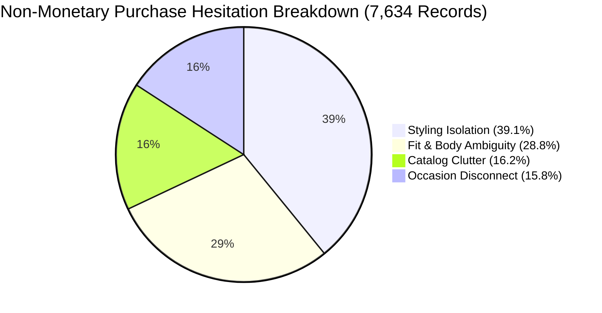

# Product Manager Handover & Operational Runbook

> **Product Suite:** Myntra Growth & Discovery Platform  
> **Tool Name:** Wishlist AI Discovery & Intelligence Engine  
> **Document Version:** 1.0.0 (Phase 4 Final Handover)  
> **Audience:** Growth Product Managers, Technical PMs, UX Leads, Engineering Directors  

---

## 1. Executive Overview

The **Myntra Wishlist AI Discovery & Intelligence Engine** is an internal strategic analytics tool built for Growth Product Managers to systematically analyze non-monetary purchase hesitation among high-intent shoppers who save items to their Wishlist or Bag but fail to checkout.

### Core Constraint: Zero Monetary Incentives Rule
Standard e-commerce growth strategies often reflexively default to discounting or coupon distribution. This engine strictly isolates **pure UX, psychological, and styling barriers** by dropping 100% of price-related noise (`Monetary_Wait`), enabling Product Managers to build high-margin structural product features.

---

## 2. Cognitive Taxonomy & Data Mental Model

The engine continuously processes customer discussions across Reddit, YouTube, and App Store reviews into 4 primary non-monetary cognitive friction buckets:



| Cognitive Friction | Share | Psychological Trigger | PM Action Area |
| :--- | :---: | :--- | :--- |
| **`Styling_Isolation`** | **39.1%** | Shopper likes the piece but lacks outfit pairing clarity, accessory inspiration, or layer visualization. | Outfit Bundling & "Complete the Look" recommendations. |
| **`Fit_Body_Ambiguity`** | **28.8%** | Uncertainty around cut, stretch, waist-to-hip ratio, inseam length, and fear of returns. | Dynamic Fit Bars, model metric tagging, real buyer try-on videos. |
| **`Catalog_Clutter`** | **16.2%** | Decision fatigue from duplicate listings, color studio distortion, and search exhaustion. | Catalog deduplication, real lighting photos, enhanced fabric filters. |
| **`Occasion_Disconnect`** | **15.8%** | Inability to justify purchase due to lack of immediate wearing occasions (e.g. WFH shifts). | Wishlist event folders, season reminders, multi-occasion styling guides. |

---

## 3. Executive Dashboard Navigation Guide

To launch the dashboard locally or on Streamlit Cloud:
```bash
streamlit run streamlit_app.py
```

### Dashboard Sections:
1. **Top KPI Row:** Instant health metrics displaying total valid records analyzed (`7,634`), total monetary noise purged (`610`), and the dominant friction pattern (`Styling Isolation 39.1%`).
2. **Interactive Visualizations:**
   - **Friction Categories Donut Chart:** High-level volume and percentage share per hesitation category.
   - **Channel Stacked Bar Chart:** Friction distribution across Reddit (organic community), YouTube (try-on video feedback), and App Store reviews.
3. **Verbatim Evidence Explorer:**
   - Use the category dropdown filter to inspect real consumer quotes.
   - Each card displays source channel, confidence score, and highlighted verbatim proof.
4. **Strategic Recommendation Banner:**
   - Click **"View MVP Proposal"** to expand the PRD for the top-priority Growth initiative.

---

## 4. Strategic Product Roadmap & Feature PRDs

Based on the 7,634 analyzed feedback records, the Growth PM team should prioritize the following 4 strategic initiatives for Q3/Q4 roadmaps:

### PRD 1: "Complete the Look" AI Bundling MVP *(Priority 1 — Styling Isolation: 39.1%)*
* **Target Impact:** **+12% Wishlist-to-Cart Conversion**, **+18% Average Order Value (AOV)**.
* **Core Capabilities:**
  1. *Dynamic Outfit Generator:* Automatically display 3 curated outfit bundles (e.g., Office Casual, Weekend Brunch, Evening Party) for any saved wishlist SKU.
  2. *1-Click Bundle Add-to-Bag:* Allow shoppers to add paired bottoms, layers, or footwear with a single click.
  3. *Wardrobe Harmony Preview:* Visual canvas allowing users to drag-and-drop saved wishlist items together.

### PRD 2: Dynamic Fit & Measurement Intelligence *(Priority 2 — Fit Ambiguity: 28.8%)*
* **Target Impact:** **-15% Sizing-Related Returns**, **+8% Checkout Confidence**.
* **Core Capabilities:**
  1. *Model Measurement Badges:* Display model height, bust, waist, and size worn prominently on every SKU.
  2. *Buyer Fit Distribution Bar:* Show percentage breakdown of *"Runs Small"*, *"True to Size"*, and *"Runs Large"* aggregated from verified reviews.
  3. *Inseam & Stretch Indicators:* Explicitly state fabric elasticity index (Rigid vs. Comfort Stretch vs. Super Stretch).

### PRD 3: Catalog Deduplication & Lighting Realism *(Priority 3 — Catalog Clutter: 16.2%)*
* **Target Impact:** **-25% Search Abandonment Rate**, **+10% Session Duration**.
* **Core Capabilities:**
  1. *Variant Grouping:* Group identical private label and clone listings under a single canonical product page.
  2. *Studio vs. Natural Light Toggle:* Allow shoppers to toggle between studio-lit photography and customer unboxing photos.

### PRD 4: Wishlist Event Folders & Smart Reminders *(Priority 4 — Occasion Disconnect: 15.8%)*
* **Target Impact:** **+14% Re-engagement on Stale Wishlist Items**.
* **Core Capabilities:**
  1. *Occasion Tagging:* Allow users to organize wishlists into folders (*"Summer Vacation"*, *"Office Wear"*, *"Wedding Guest"*).
  2. *Event Countdown Sync:* Set a target date (e.g. friend's wedding in October) to trigger timely preparation alerts.

---

## 5. Operational Runbook & CLI Commands

| Workflow | Command | Output Artifact |
| :--- | :--- | :--- |
| **Run Full Master Pipeline** | `python scripts/run_pipeline.py` | Complete Ingestion $\rightarrow$ Classification $\rightarrow$ QA Audit |
| **Run Multi-Channel Ingestion** | `python scripts/run_ingestion.py` | Updates `data/myntra_wishlist_lake.db` (Raw feedback) |
| **Run LLM Batch Classification** | `python scripts/run_classification.py` | Populates `classified_feedback` & `monetary_purge_log` |
| **Run QA & Compliance Audit** | `python scripts/run_audit.py` | Prints Zero-Monetary Purity & Hallucination rates |
| **Run Automated Test Suite** | `pytest -v` | Executes 18 unit/integration/UI tests |
| **Launch Streamlit Dashboard** | `streamlit run streamlit_app.py` | Local web app at `http://localhost:8501` |

---

## 6. Contacts & Team Ownership
- **Lead Growth Product Manager:** Product taxonomy, stakeholder readout, and PRD ownership.
- **Data Engineering Lead:** Scraping pipelines, PostgreSQL lake maintenance, and Streamlit architecture.
- **AI/LLM Engineer:** Prompt engineering, confidence calibration, and hallucination drift monitoring.
