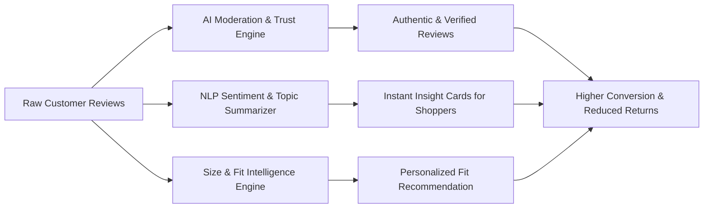

# Problem Statement: AI-Powered Review Intelligence & Authenticity System for Myntra

> **Project Name:** Myntra AI Review Intelligence & Governance Engine  
> **Domain:** E-Commerce / Fashion Tech / Generative AI & NLP  
> **Target Audience:** Myntra Shoppers, Operations & Moderation Teams, Partner Brands & Sellers  

---

## 1. Executive Summary

Myntra is India's leading e-commerce platform for fashion, beauty, and lifestyle products, handling millions of customer transactions daily. User-Generated Content (UGC), specifically customer reviews, star ratings, and uploaded images, serves as the primary trust signal for online fashion shoppers.

However, as the platform scales, the sheer volume of reviews—coupled with the rise of synthetic AI-generated content, unstructured feedback, and inconsistent size/fit ratings—presents significant challenges to consumer trust and platform operational efficiency. 

This project aims to define and architect an **AI-Powered Customer Review Intelligence Platform** that automates content moderation, filters fake/spam reviews, dynamically summarizes customer sentiment, and extracts granular size & fit insights to enhance purchase confidence and reduce return rates.

---

## 2. Background & Strategic Context

In fashion e-commerce, purchasing decisions rely heavily on qualitative factors that standardized product descriptions cannot fully convey:
- **Material & Fabric Feel:** Is the fabric breathable? Is it transparent? Does it shrink after washing?
- **Color Accuracy:** Does the actual product match the studio-lit product photos?
- **Size & Fit Variability:** How does a "Medium" fit across different brands, cuts, and body types?

While customer reviews are intended to answer these questions, shoppers often face **information overload** (scrolling through hundreds of repetitive reviews) or **information deficit** (vague reviews like "Nice product" or "Good delivery"). Additionally, return rates in fashion e-commerce average **25%–40%**, with **size and fit issues accounting for over 60% of returns**.

---

## 3. Key Challenges & Problem Definition

### 3.1 Shopper Pain Points
1. **Unstructured & Repetitive Feedback:** Shoppers must read through hundreds of reviews to find relevant insights regarding fit, fabric quality, or durability.
2. **Erosion of Trust via Synthetic & Fake Reviews:** The rise of LLM-generated reviews, bot spam, and incentivized feedback dilutes review authenticity.
3. **Lack of Personalized Fit Context:** Generic rating distributions fail to reflect how a garment will fit a shopper with specific body measurements or proportions.
4. **Delivery/Service Bias in Product Reviews:** Product ratings are often degraded by logistical issues (e.g., delayed delivery, damaged outer packaging) rather than actual product quality.

### 3.2 Business & Operational Pain Points
1. **High Return Rates Driven by Fit Discrepancies:** Inaccurate customer sizing expectations directly increase reverse logistics costs and inventory lock-up.
2. **Moderation Scalability Bottlenecks:** Manual moderation teams cannot keep pace with peak sale events (e.g., Big Fashion Festival), leading to backlog or missed policy violations.
3. **Unrealized Seller Insights:** Brands selling on Myntra lack aggregated, actionable feedback on manufacturing defects, sizing inconsistencies, or fabric quality trends.

---

## 4. Formal Problem Statement

> **How might we construct an intelligent, end-to-end AI system for Myntra that validates review authenticity in real time, distills thousands of customer reviews into actionable visual summaries, and derives personalized size & fit intelligence to maximize shopper conversion and minimize fit-related returns?**

---

## 5. Core Objectives & Key Performance Indicators (KPIs)

### 5.1 System Objectives
* **Authenticity Assurance:** Detect and flag synthetic (AI-written), spam, and incentivized reviews with high precision.
* **Smart Summarization:** Automatically generate concise, aspect-based sentiment summaries (e.g., Fabric, Fit, Color, Stitching) for every SKU.
* **Fit Intelligence Extraction:** Parse review text to extract height, weight, build, and fit feedback to create dynamic fit profiles.
* **Operational Automation:** Automate low-risk review approvals while routing ambiguous or high-risk content to human moderators.

### 5.2 Target Metrics & Success Criteria

| Metric Category | Key Performance Indicator (KPI) | Target Benchmark |
| :--- | :--- | :--- |
| **Trust & Safety** | Synthetic / Fake Review Detection Precision | **> 95%** |
| **Trust & Safety** | Moderation Backlog Reduction | **> 70%** automated approval |
| **User Experience** | Average Time-to-Insight per Product Page | **< 5 seconds** (via AI summaries) |
| **Business Impact** | Size/Fit Related Product Return Rate | **15% - 20% Reduction** |
| **Business Impact** | Purchase Conversion Rate on Reviewed SKUs | **+ 8% - 12% Increase** |

---

## 6. Functional Requirements & System Architecture

### Module 1: Fake & Synthetic Review Detection Engine
* **Language & Style Analysis:** Detect statistical anomalies in text perplexity, burstiness, and repetitive phrase structures indicative of AI generation.
* **Behavioral Pattern Matching:** Cross-reference reviewer account age, review frequency, IP metadata, and purchase verification status.
* **Sentiment Discrepancy Check:** Flag reviews where text sentiment contradicts the numeric star rating.

### Module 2: Aspect-Based Sentiment & Summarization Engine
* **Aspect Extraction:** Identify key fashion-specific attributes (e.g., *Fabric Quality, Color Retention, Stitching, Transparency, Softness*).
* **Pros & Cons Synthesis:** Automatically compute consensus points (e.g., *"85% of buyers say fabric is super soft, 12% note it shrinks slightly after first wash"*).
* **Noise Filter:** Isolate and separate logistics/delivery complaints from product quality evaluations.

### Module 3: Dynamic Size, Fit & Body Type Intelligence
* **NER (Named Entity Recognition):** Extract body metrics mentioned in reviews (e.g., *"I am 5'8 and 68kg, M size fits perfectly"*).
* **Fit Delta Computation:** Determine whether a SKU runs *Small*, *True to Size*, or *Large* based on aggregated customer data.
* **Visual Review Analytics:** Classify customer-uploaded images for lighting quality, relevance, and garment fit visualization.

### Module 4: Seller & Brand Analytics Dashboard
* **Defect Alerting:** Notify brands when negative sentiment around a specific aspect (e.g., *Zipper Quality*) spikes post-launch.
* **Sizing Calibration:** Provide brand partners with data-backed sizing chart correction recommendations.

---

## 7. System Scope & Boundaries

### In-Scope
- Text and image review processing for Myntra catalog SKUs.
- Automated NLP pipelines for sentiment analysis, aspect categorization, and fake review detection.
- Customer-facing UI components (Summary Cards, Fit Distribution Bars, Filter by Height/Size).
- Merchant-facing analytics dashboard for feedback trends.

### Out-of-Scope
- Modifications to core payment or checkout workflows.
- Logistics partner rating systems (handled via separate delivery feedback channels).
- Customer support ticket resolution (integrated via API, but managed by CS platform).

---

## 8. Proposed Technology Stack

| Layer | Recommended Technologies |
| :--- | :--- |
| **Data Ingestion** | Apache Kafka, AWS Kinesis |
| **NLP & LLM Engine** | PyTorch, Hugging Face Transformers, RoBERTa / DeBERTa, OpenAI / Gemini API (Fine-tuned) |
| **Vector & Search Database** | Pinecone / Qdrant, Elasticsearch / OpenSearch |
| **Backend Services** | Python (FastAPI / PyTorch), Node.js / Go |
| **Frontend Integration** | React / Next.js, React Native (Mobile App) |
| **Storage & Data Warehouse** | PostgreSQL, Snowflake / BigQuery |

---

## 9. Conclusion

By implementing the **AI-Powered Review Intelligence & Authenticity System**, Myntra can fortify customer trust, significantly streamline review moderation workflows, and empower shoppers with immediate, actionable sizing and quality insights—ultimately driving higher conversion rates and drastically lowering return overhead.
